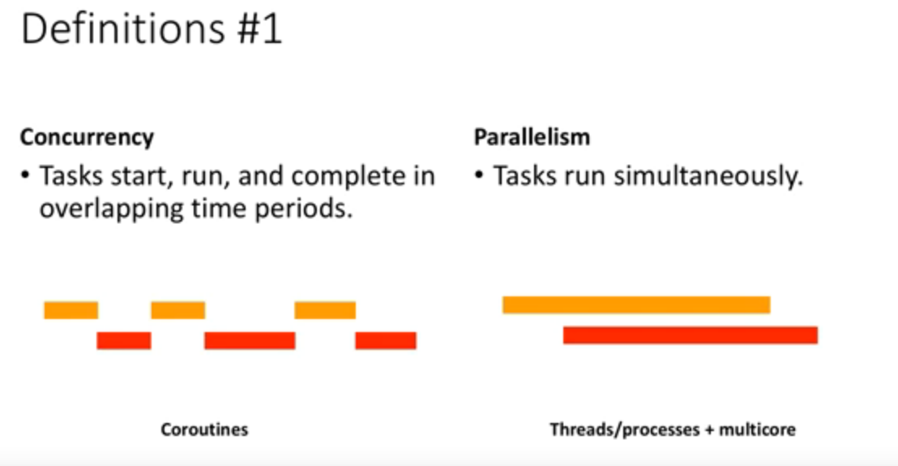
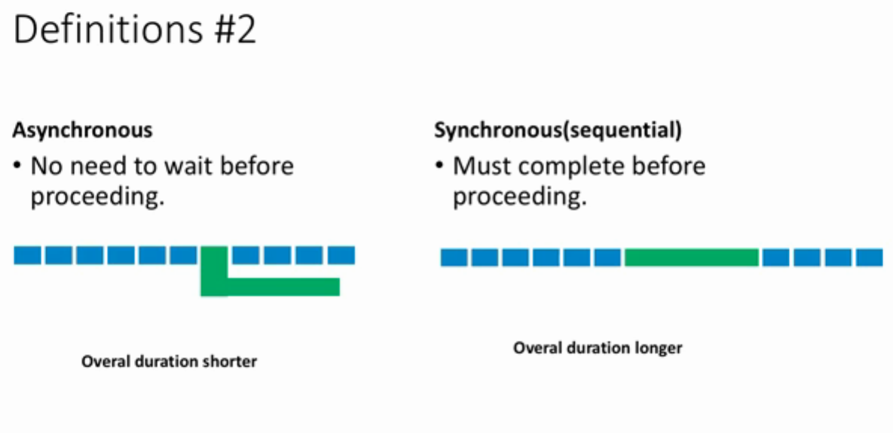
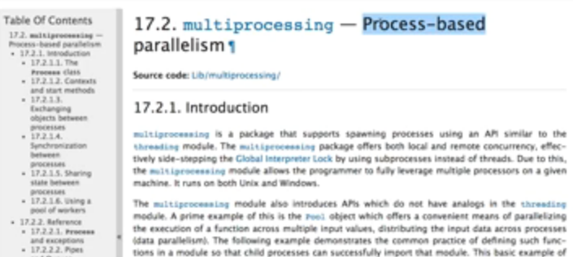

## yield 的用法

例子1

```python
def foo():
    print("starting...")
    while True:
        print("开始循环...")
        res = yield 4
        print("res:", res)


g = foo()  # 什么也没有发生
print(next(g))  # 运行到yield 4 就不再运行了；res = 这个赋值语句也没有运行。yield 4相当于返回4
print("*"*20)
print(next(g))  # 从res = 这个赋值语句开始运行，这时res = None；运行到下一个yield 4
```

输出结果：
```
starting...
开始循环...
4
********************
res: None
开始循环...
4
```

> 带有yield 的函数是生成器函数，不会立即运行。
>
> 这个生成器有个`next()`方法，调用next时，会从上次return的地方继续运行。


例子2

```python
def foo():
    print("starting...")
    while True:
        print("开始循环...")
        res = yield 4
        print("res:",res)


g = foo()  # 什么也没有发生
print(next(g))  # 运行到yield 4，这里会输出4
print("*"*20)
print(g.send(7))  # 这个send函数传送一个值给生成器，并调用next继续运行
```

输出结果：

```
starting...
开始循环...
4
********************
res: 7
开始循环...
4
```

## python3 异步编程

+　基本概念：并发、并行、同步、异步
+　如何实现异步
+　python3 的异步IO库 asyncio

### 基本概念



+ concurrency (并发)
+ parallelism (并行)



+ asynchronous 异步
+ synchoronous 同步

 ### GIL (Global Interpreter Lock) 全局解释器锁

由于锁的存在，同一时间只能有一个thread执行。即使我们使用多个thread，一个时间也只能有一个thread执行。

如何避开这个问题？可使用`multiprocessing`这个库，基于`process线程`去实现，来避开thread锁。


### 同步异步并行并发：应该选择哪个？

CPU密集型：Multi Processing；并发

IO密集型：程序快慢取决于IO的速度，如果IO很快，可以使用Multi threading；

如果IO很慢，可以使用Asyncio，异步方式。


### 如何写一个异步程序？通过原生python

```python
import time
def foo():
    for i in range(100, 10000):
        print(i)
        time.sleep(0.5)
```

这个函数一直等到循环结束才能停止。假如这部分代码是某个程序的一部分，我们的程序就做不了其他事情了。

一些修改：首先让程序能够中断，让其他程序能够有执行的机会

```python
import time
def foo():
    for i in range(100, 10000):
        print(i)
        yield
        time.sleep(0.5)

a = foo()
next(a)
print("Something happens...")
next(a)
```

实现task manager：通过queue event loop来

我们有如下程序：

```python
import time
from datetime import datetime


def print_message_periodical(interval_seconds, message='keep alive'):
    while True:
        print(f'{datetime.now()} - {message}')
        start = time.time()
        end = start + interval_seconds
        while True:
            now = time.time()
            if now >= end:
                break

if __name__ == "__main__":
    print_message_periodical(3, 'three')
    # print_message_periodical(10, 'ten')

```

该程序每3秒打印一次时间：

```
2019-05-12 22:50:23.971999 - three
2019-05-12 22:50:26.972033 - three
2019-05-12 22:50:29.972067 - three
2019-05-12 22:50:32.972093 - three
2019-05-12 22:50:35.972118 - three
```

这个程序是阻塞的，如果我们再想每10秒打印一次，是没法执行的。

只需要简单的修改就可以实现异步执行的效果：

```python
import time
from datetime import datetime


def print_message_periodical(interval_seconds, message='keep alive'):
    while True:
        print(f'{datetime.now()} - {message}')
        start = time.time()
        end = start + interval_seconds
        while True:
            yield
            now = time.time()
            if now >= end:
                break

if __name__ == "__main__":
    a = print_message_periodical(3, 'three')
    b = print_message_periodical(10, 'ten')
    stack = [a, b]
    while True:
        for task in stack:
            next(task)
```

这个stack里能存放很多个异步代码，不停地循环，进行执行。这就是事件循环。

执行结果：

```
2019-05-12 22:55:20.409057 - three
2019-05-12 22:55:20.409093 - ten
2019-05-12 22:55:23.409094 - three
2019-05-12 22:55:26.409129 - three
2019-05-12 22:55:29.409158 - three
2019-05-12 22:55:30.409104 - ten
```

### 用asyncio修改上述代码

```python
import time
from datetime import datetime
import asyncio

async def print_message_periodical(interval_seconds, message='keep alive'):
    while True:
        print(f'{datetime.now()} - {message}')
        start = time.time()
        end = start + interval_seconds
        while True:
            await  asyncio.sleep(0)  # yield
            now = time.time()
            if now >= end:
                break

if __name__ == "__main__":
    # a = print_message_periodical(3, 'three')
    # b = print_message_periodical(10, 'ten')
    # stack = [a, b]
    # while True:
    #     for task in stack:
    #         next(task)
    scheduler = asyncio.get_event_loop()
    scheduler.create_task(
        print_message_periodical(3, 'three')
    )
    scheduler.create_task(
        print_message_periodical(10, 'ten')
    )
    scheduler.run_forever()
```


需要修改的地方非常少，函数体中只修改两行，另外event loop 更容易定义与拓展了。

+ [参考1](https://blog.csdn.net/mieleizhi0522/article/details/82142856)
+ [参考2](https://www.youtube.com/playlist?list=PLfQqWeOCIH4ClkdjqvTuc9hnCnagSlBHE)

